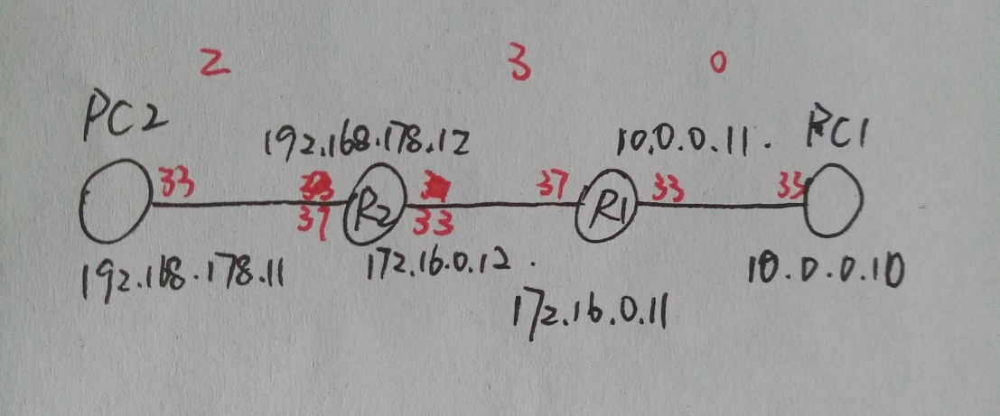

# 基于UDP和IP的RTT简单获取实现

## 前言

UDP

用户数据报协议(User Datagram Protocol, UDP)，是开放式系统互联(Open System Interconnection, OSI)参考模型中的一种无连接的
传输层协议，提供面向事务的简单不可靠信息传送服务。

UDP提供的不可靠、无连接的数据交付服务，主要指的是它没有使用确认机制来确保报文的到达，没有对传入的报文进行排序，也不提供反馈信息
来控制机器之间报文传输的速度。因此，UDP报文可能会出现丢失、延迟或乱序到达等现象。而且报文到达的速率可能大于接受进程能够处理的速率。

UDP数据报报文格式很简单，分为UDP首部和UDP数据区两个部分。其中UDP首部有4个域组成，其中每个域各占用2个字节，具体包括源端口号、目的端口号、
数据报长度和校验值。UDP首部总共只占用8个字节。

单从可靠性的角度看，TCP(Transmission Control Protocol)优于UDP，但是UDP也正正因为不需要考虑可靠性机制，所以UDP的传输处理效率
要远优于TCP。所以在对可靠性要求不高或者要求传输效率的时候，UDP是一种适合的方案。

IP

互联网协议(Internet Protocol, IP)是IP层的核心协议，它提供无连接的IP数据报投递服务,无论传输层使用何种协议，都要依靠IP来发送和接收
数据。

IP的设计目的是为了提高网络的可扩展性：一是解决互联网问题，实现大规模、异构网络的互联互通；二是分割顶层网络应用和底层网络技术之间的
耦合关系，以利于两者的独立发展。

IP是一种只为主机提供无连接、不可靠、尽力而为的数据报传输服务。

1. 提供一种无连接的投递机制。IP独立地对待要传输的每一个数据报，在传输前不建立连接，从同一源主机到同一目的主机的数据报可能经过不同的传输路径。
2. 不保证数据报的可靠性。数据报在传输过程中可能出现丢失、重复、延迟和乱序，但IP不会将这些现象报告给发送方和接收方，也不会试图去纠正传输中的错误。
3. 提供了尽最大努力的投递机制。IP尽最大努力发送数据报，也就是说，它不会随意放弃数据报，只有当资源耗尽或者底层网络出现故障时，才会出现数据报丢失的情况。

RTT

往返时延(Round-Trip Time, RTT)是一个重要的性能指标，它表示从发送方发送数据开始，到发送方收到来自接收方的确认，总共经历的时延。
往返时延RTT由三个部分决定：即链路的传播时间、末端系统的处理时间以及路由器的缓存中的排队和处理时间。其中前两个时间相对固定，路由器的缓存
中的排队和处理时间会随着整个网络拥塞程度的变化而变化，因此往返时延一定程度上反映着网络的状况。

路由转发

路由器仅根据网络地址进行转发。当IP数据报经由路由器转发时，如果目标网络与本地路由器直接相连，则直接将数据包交付给目标主机；否则，路由器
通过路由表产找路由信息，并将数据报转交给指明的下一跳路由器；如果没有路由，但路由表中哟一个默认路由，则把数据报传送给指明的默认路由；如果
两者都没有，则丢弃数据包并报告错误。

## 仿真实现

### 目的

本文目的是得到通信两端的往返时延RTT。

### 原理

本文原理是在现有的网路层和传输层的基础上传输定制的报文信息。

（首先本文假设考虑每一台虚拟机上的时间是一致的，都是通过网络一致的时间，也就是统一时钟）

本文基于所构建的网络环境比较简单，没有复杂的网络拓扑，传输的数据量也比较少，一般不会造成网络拥塞现象。

因此考虑两端的往返时间RTT = 2 * T来表示，其中T为单向的传输时延。

### 实现 

1. 部署环境

2. 代码实现
   1. 定义报文格式
   2. 服务器实现
   3. 客户端实现

3. 结果

## 结论与分析

环境：本实验总共使用四台虚拟机，每一台虚拟机都是Centos7系统，都是构建在在VMware
Workstation 15 pro中

-   配置现有的网络层和传输层

1.  实验通过将四台虚拟机首尾相连，构建成三个不同的虚拟内网

2.  通过配置中间的两台虚拟机，使其变为具有转发功能的路由器（以下称为路由器）

3.  添加相应的虚拟网卡，并且配置对应的ip地址

4.  配置两台主机的默认网关，配置两台路由器的路由信息

-   通过定制的报文在现有的网络层和传输层上传输信息

1.  通过定制报文传输对应的时间点

拓扑图

配置网络结构
------------

1.  首尾相连构建不同的虚拟内网

1.  中间两台虚拟机配置成具有转发功能的路由器

~~~~~~~~~~~~~~~~~~~~~~~~~~~~~~~~~~~~~~~~~~~~~~~~~~~~~~~~~~~~~~~~~~~~~~~~~~~~~~~~
# 对于R1,R2一样配置
# 先关闭防火墙
iptables -F

# 将默认关闭的路由转发功能打开
echo "1" > /proc/sys/net/ipv4/ip_forword
~~~~~~~~~~~~~~~~~~~~~~~~~~~~~~~~~~~~~~~~~~~~~~~~~~~~~~~~~~~~~~~~~~~~~~~~~~~~~~~~

1.  添加虚拟网卡，配置相应的ip地址

其中R1和R2为两个网卡，并且配置如拓扑图的ip地址信息，构成多个内网模拟现实状态。（其中使用的VMware中ens33或者ens37接口）

1.  配置两台主机的默认网关，配置两台路由器的路由信息

~~~~~~~~~~~~~~~~~~~~~~~~~~~~~~~~~~~~~~~~~~~~~~~~~~~~~~~~~~~~~~~~~~~~~~~~~~~~~~~~
# R1添加路由信息
# 去往192.168.178.0/24段的路由
route add -net 192.168.178.0/24 gw 172.16.0.12 dev ens33
~~~~~~~~~~~~~~~~~~~~~~~~~~~~~~~~~~~~~~~~~~~~~~~~~~~~~~~~~~~~~~~~~~~~~~~~~~~~~~~~

~~~~~~~~~~~~~~~~~~~~~~~~~~~~~~~~~~~~~~~~~~~~~~~~~~~~~~~~~~~~~~~~~~~~~~~~~~~~~~~~

~~~~~~~~~~~~~~~~~~~~~~~~~~~~~~~~~~~~~~~~~~~~~~~~~~~~~~~~~~~~~~~~~~~~~~~~~~~~~~~~

~~~~~~~~~~~~~~~~~~~~~~~~~~~~~~~~~~~~~~~~~~~~~~~~~~~~~~~~~~~~~~~~~~~~~~~~~~~~~~~~
# R2添加路由信息
# 去往10.0.0.0/24段的路由
route add -net 10.0.0.0/24 gw 172.16.0.11 dev ens33
~~~~~~~~~~~~~~~~~~~~~~~~~~~~~~~~~~~~~~~~~~~~~~~~~~~~~~~~~~~~~~~~~~~~~~~~~~~~~~~~

~~~~~~~~~~~~~~~~~~~~~~~~~~~~~~~~~~~~~~~~~~~~~~~~~~~~~~~~~~~~~~~~~~~~~~~~~~~~~~~~

~~~~~~~~~~~~~~~~~~~~~~~~~~~~~~~~~~~~~~~~~~~~~~~~~~~~~~~~~~~~~~~~~~~~~~~~~~~~~~~~

~~~~~~~~~~~~~~~~~~~~~~~~~~~~~~~~~~~~~~~~~~~~~~~~~~~~~~~~~~~~~~~~~~~~~~~~~~~~~~~~
# PC1添加默认网关
route add -net default gw 10.0.0.11
# PC2添加默认网关
route add -net default gw 192.168.178.12
~~~~~~~~~~~~~~~~~~~~~~~~~~~~~~~~~~~~~~~~~~~~~~~~~~~~~~~~~~~~~~~~~~~~~~~~~~~~~~~~

~~~~~~~~~~~~~~~~~~~~~~~~~~~~~~~~~~~~~~~~~~~~~~~~~~~~~~~~~~~~~~~~~~~~~~~~~~~~~~~~

~~~~~~~~~~~~~~~~~~~~~~~~~~~~~~~~~~~~~~~~~~~~~~~~~~~~~~~~~~~~~~~~~~~~~~~~~~~~~~~~

1.  测试两台主机的连通性

~~~~~~~~~~~~~~~~~~~~~~~~~~~~~~~~~~~~~~~~~~~~~~~~~~~~~~~~~~~~~~~~~~~~~~~~~~~~~~~~
# PC1 ping PC2
ping 192.168.178.11
~~~~~~~~~~~~~~~~~~~~~~~~~~~~~~~~~~~~~~~~~~~~~~~~~~~~~~~~~~~~~~~~~~~~~~~~~~~~~~~~

~~~~~~~~~~~~~~~~~~~~~~~~~~~~~~~~~~~~~~~~~~~~~~~~~~~~~~~~~~~~~~~~~~~~~~~~~~~~~~~~

~~~~~~~~~~~~~~~~~~~~~~~~~~~~~~~~~~~~~~~~~~~~~~~~~~~~~~~~~~~~~~~~~~~~~~~~~~~~~~~~

定制化报文传输
--------------

1.  定制化报文

2.  使用UDP+IP进行传输报文

3.  查看结果

实验结果
--------

本实验通过配置中间两台虚拟机作为路由器用作转发工具，然后成功实现基于网络层和传输层之上的定制化的报文传输。

但是存在一个问题是中间的两台路由器是不会向我们发送方传输我们定制化的报文的，如果要实现这个功能，我们需要在本实验的基础上实现一个在传输层之上的一个新的传输层协议来控制中间两台路由器的定制化的报文的传输。
因为考虑到基于网络层的转发功能是不会拆解传输层的报文的，而我们在当前情况只能在网络层传输层之上进行编程，所以如果要实现新增的传输层协议，我们不能仅仅依靠网络层的传输功能，而且需要新增的传输层进行拆包查看里面的内容再进行控制转发。这样每一次的转发都要先经过传输层，具体测试出来的RTT会变大。
